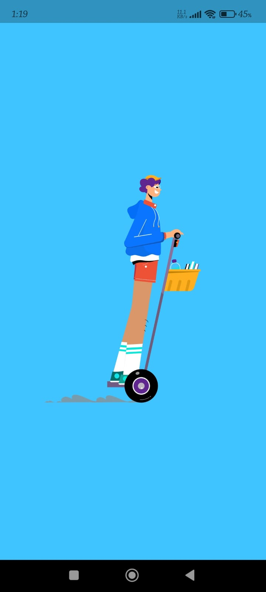
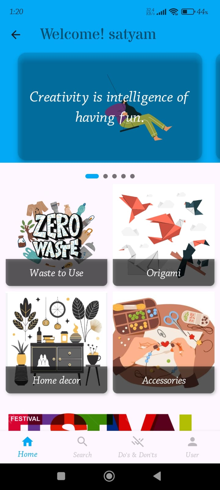
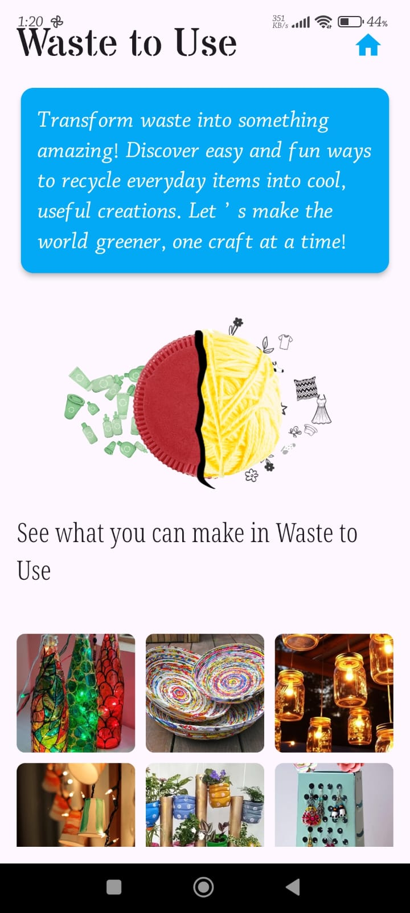

# 🎨 DIY Creations - The Ultimate DIY App! 🚀

DIY Creations is the ultimate app for **craft lovers, innovators, and creators**! Whether you want to **turn waste into useful items**, create **beautiful accessories**, or explore **electronics DIY projects**, this app has everything you need. 🎭✨

## 📌 Key Features

- **🗂 Explore Categories**: Browse DIY projects in categories like **Waste-to-Use, Crafts, Accessories, Electronics, and more**.
- **📖 Step-by-Step Tutorials**: Each project includes a **materials list, detailed instructions, and video guides**.
- **🔍 Search & Discover**: Easily find DIY ideas and relevant content.
- **📺 YouTube Integration**: Watch DIY videos from **multiple channels** directly in the app.
- **🎨 User Creations**: Create your **own DIY profile** and **upload your projects** to share with others.
- **❤️ Wishlist**: Favorite your projects and access them anytime in your wishlist.
- **🎊 Festival Crafts**: Special DIY ideas for festivals like **Diwali, Holi, and more**.
- **💡 Fun DIY Facts**: Learn interesting **facts about DIY materials and techniques**.
- **🌀 Animation**: Eye-catching **unique UI with smooth animations and animated text**.

---

## 📲 App Flow (Use Case)

1. **🚀 Splash Screen**: The app starts with a **beautiful animated splash screen**.
2. **🎭 Onboarding Screen**: Engaging onboarding screens make the app more interactive.
3. **🔑 Login & Registration**: Users can **sign up or log in** to access features.
4. **🏡 Home Page**: Explore all categories, featured projects, and new ideas.
5. **🔍 Search Functionality**: Easily find DIY content and ideas.
6. **🖌 Add Your Creation**: Users can **upload their own projects** and showcase creativity.
7. **✅ Do’s and Don’ts**: Safety **precautions and guidelines** for craft projects.

---

## 🔧 Prerequisites

To run this project, you need:
- A **Google account** & **Firebase setup**
- YouTube **API Key** for video integration

### 🎯 Get Your YouTube API Key
1. Log in to **Google Cloud** with your Google account.
2. Search for **YouTube Data API v3**.
3. **Enable** it.
4. Get your **API Key** in the **Credentials section**.

---

## 📸 Screenshots

| Splash Screen                      | Home Page                            | DIY Categories                           |
|------------------------------------|--------------------------------------|------------------------------------------|
|  |  |  |

---

